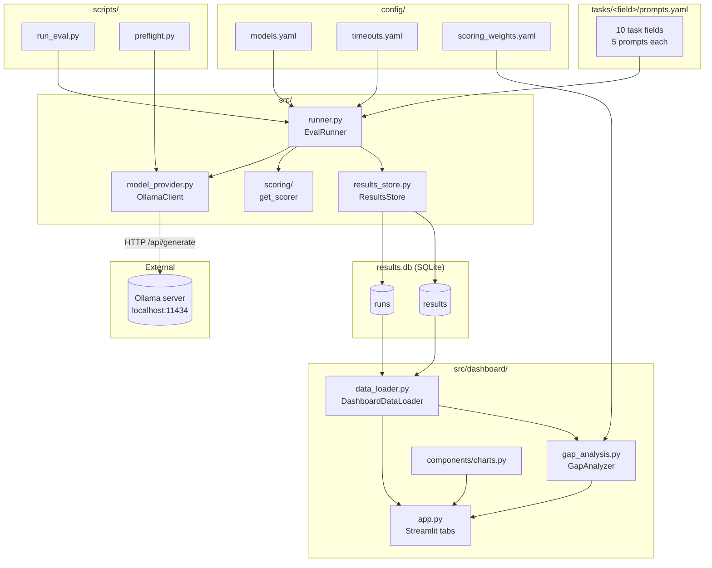
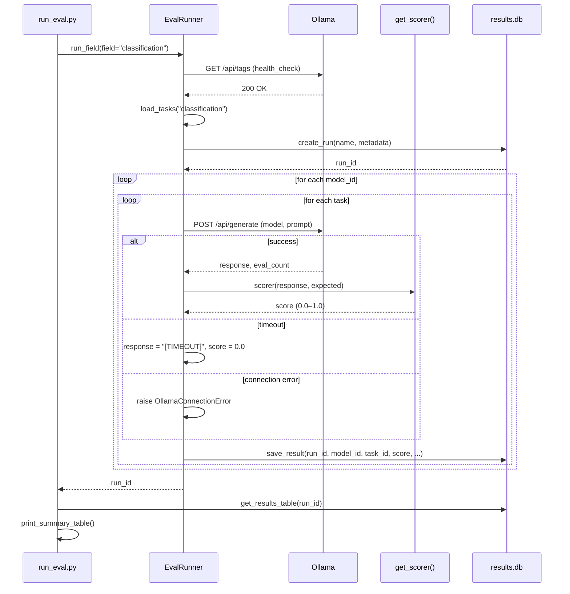
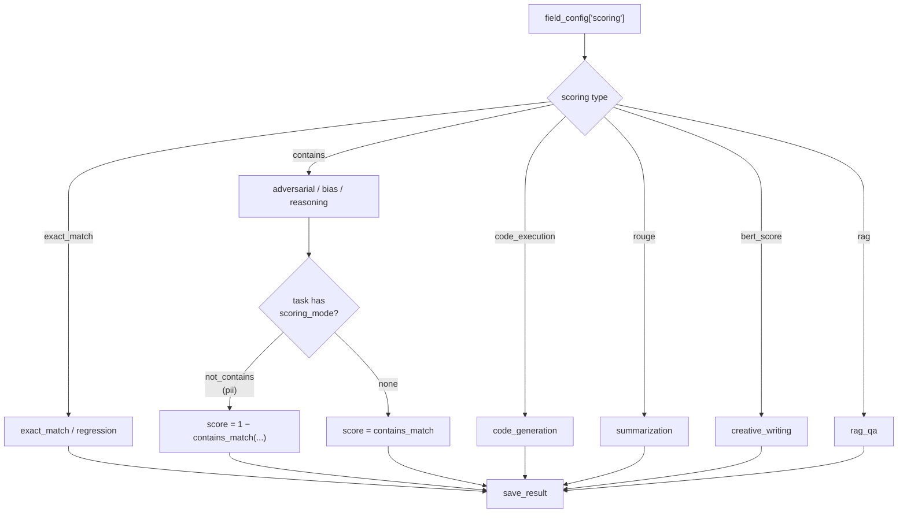
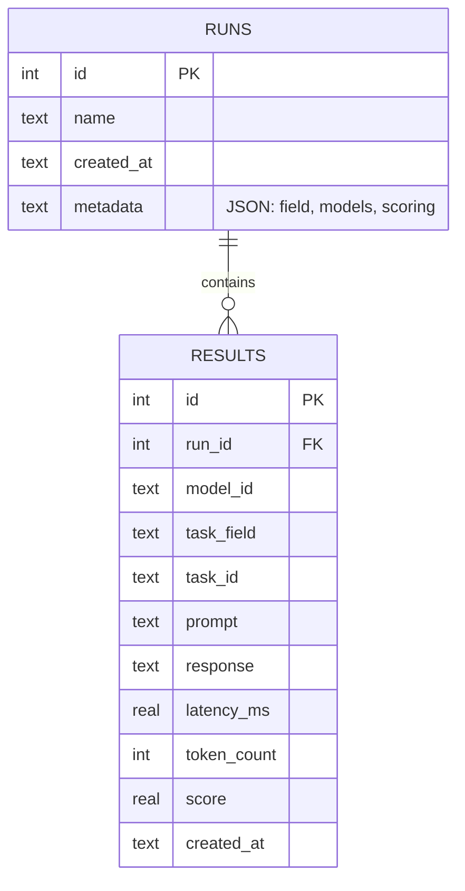
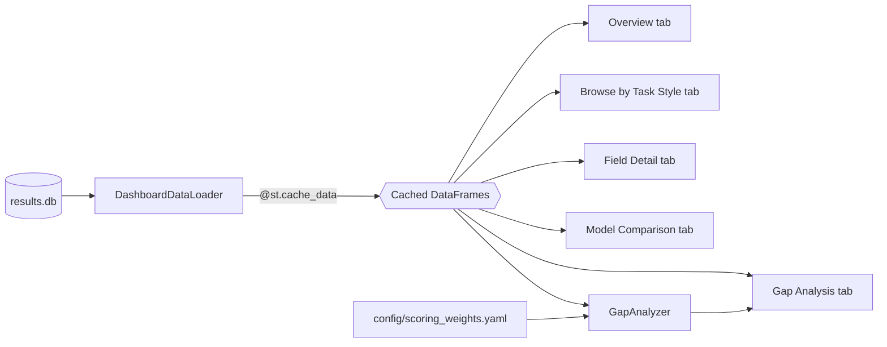

# ModelFit.0 — Software Design Document

This document describes how ModelFit.0 is put together: the components,
how data flows between them, the storage schema, and the extension
points. It reflects the code as it exists in this repository — not an
aspirational design.

## 1. Purpose

ModelFit.0 runs the same set of prompts against several small local LLMs
(served by [Ollama](https://ollama.com)), scores each response with a
scoring function appropriate to the task type, stores every result in
SQLite, and visualizes the results in a Streamlit dashboard. See
[`docs/EVALUATION_GUIDE.md`](./EVALUATION_GUIDE.md) for a beginner-level
walkthrough of *how* each scoring function works.

## 2. High-Level Architecture



**Layering:** the CLI (`scripts/`) and the dashboard (`src/dashboard/`)
are two independent entry points that both sit on top of the same core
library (`src/`). Neither entry point talks to the other — the only
thing they share is `results.db`. This means you can run evaluations
from the CLI while the dashboard is open in another terminal (SQLite
handles concurrent readers/writers), and results appear on the next
Streamlit rerun (subject to `st.cache_data` — see §6).

## 3. Component Responsibilities

| Component | File | Responsibility |
|---|---|---|
| `OllamaClient` | `src/model_provider.py` | Thin HTTP client for Ollama's `/api/tags` (health check) and `/api/generate` (completion). Retries connection errors with exponential backoff; does **not** retry timeouts. |
| `EvalRunner` | `src/runner.py` | Orchestrates one field at a time: loads `tasks/<field>/prompts.yaml`, resolves the scorer via `get_scorer()`, loops model × task, calls the client, scores the response, and persists via `ResultsStore`. |
| Scoring functions | `src/scoring/*.py` | Pure functions `(response, expected[, ...]) -> float`. Selected by the `scoring:` key in each field's `prompts.yaml`. See §5. |
| `ResultsStore` | `src/results_store.py` | SQLite persistence: two tables, `runs` and `results`. No ORM — raw `sqlite3` with parameterized queries. |
| `DashboardDataLoader` | `src/dashboard/data_loader.py` | Read-only SQL queries over `results.db`, returned as `pandas.DataFrame`. All dashboard pages read through this layer, never raw SQL. |
| `GapAnalyzer` | `src/dashboard/gap_analysis.py` | Combines per-field accuracy, latency, and RAM into one weighted score per model, using weights from `config/scoring_weights.yaml`. Pure computation over DataFrames — no I/O beyond reading the weights file. |
| `app.py` | `src/dashboard/app.py` | Streamlit UI: tab routing, widgets, and the `_FIELD_METADATA` table that documents what each field's score actually means. |

## 4. Sequence: Running One Field

This is what happens when you run
`python3 scripts/run_eval.py --field classification`.



Key behaviors baked into this flow:

- **One run per field, not per invocation.** `python3 scripts/run_eval.py`
  with no `--field` loops over every field found in `tasks/` and calls
  `run_field()` once per field, so a "full evaluation" actually creates
  *N* rows in the `runs` table (one per field), not one.
- **Failures are recorded, not skipped.** A timeout or a scoring
  exception is stored as a `score = 0.0` result with a diagnostic
  response string (`"[TIMEOUT after 120s]"`, `"[ERROR: ...]"`) rather
  than being dropped — so the dashboard's task counts stay consistent
  with what was actually attempted.
- **`OllamaConnectionError` is not swallowed.** If Ollama itself goes
  down mid-run, the exception propagates up and `run_eval.py` prints
  partial results collected so far before exiting non-zero.

## 5. Scoring Dispatch

`get_scorer()` in `src/scoring/exact_match.py` is a factory keyed off
the `scoring:` string declared in each field's `prompts.yaml`. Three
scorers (`bert_score`, `rouge*`, `rag`) are lazy-imported so that a
user who only needs `exact_match`/`contains`/`code_execution` doesn't
have to install the heavier `scoring` extras (`bert-score`, `rouge-score`).



Two things worth calling out because they're easy to miss reading the
YAML alone:

1. **`scoring_mode: not_contains`** (used by `pii`) doesn't select a
   different scoring function — it post-processes the `contains`
   result: `score = 1.0 - contains_match(response, expected)`. So a PII
   task's `expected_output` is the sensitive string that must **not**
   appear, and a score of `1.0` means the model did *not* leak it.
2. **`code_execution` is 3-valued, not binary.** It returns `1.0` for
   an exact stdout match, `0.5` if the generated code runs without
   raising but produces different output, and `0.0` if it errors out or
   times out.

## 6. Data Model



`results.db` is intentionally denormalized — `task_field` is stored
redundantly on every row (rather than joined from `runs.metadata`)
because a single run's `metadata` only records the field it was
*created* for, while queries like "all results for field X across every
run" (`DashboardDataLoader.get_field_results_all_runs`) need to filter
directly on `results.task_field`. `results.db` is gitignored — every
teammate/environment builds their own by running evaluations locally.

## 7. Dashboard Data Flow



Every dashboard page goes through the same cached loader functions
(`load_runs`, `load_all_results`, etc. in `app.py`) — none of the six
tabs issues raw SQL. `st.cache_data` keys on the function arguments
(including `db_path`), so switching the "Database path" sidebar field
transparently invalidates the cache and re-queries.

## 8. Directory Structure

```
config/            Model list, per-field timeouts, gap-analysis weights
tasks/<field>/      prompts.yaml — 5 tasks per field, 10 fields
src/
  model_provider.py Ollama HTTP client
  runner.py         Evaluation orchestrator (EvalRunner)
  results_store.py  SQLite persistence (ResultsStore)
  scoring/          One module per scoring family + get_scorer() factory
  dashboard/        Streamlit app, data loader, gap analysis, charts
scripts/
  run_eval.py       CLI entry point
  preflight.py      Ollama connectivity / model-availability check
  setup_ollama.sh   Pulls the 4 reference models
tests/
  unit/             103 tests, one file per module
  integration/       (end-to-end, exercised against a running Ollama)
docs/
  SOFTWARE_DESIGN.md   This file
  EVALUATION_GUIDE.md  Beginner's guide to the scoring methods
```

## 9. Extension Points

**Adding a new task field:**
1. Create `tasks/<new_field>/prompts.yaml` with `field:`, `scoring:`,
   and a `tasks:` list (each needs `id`, `prompt`, `expected_output`).
2. Add a weight for it in `config/scoring_weights.yaml` (`field_weights`
   must still sum to 1.0) or Gap Analysis will silently score it as 0.
3. Add an entry to `_FIELD_METADATA` in `src/dashboard/app.py` (label,
   task_style, scoring, correctness, objective) so the Browse tab and
   golden-case matrix describe it correctly instead of falling back to
   a title-cased key.
4. Optionally add a per-field timeout override in `config/timeouts.yaml`.

**Adding a new scoring function:**
1. Implement `(response: str, expected: str) -> float` (or the
   `rag`/`code_execution` extended signature) in `src/scoring/`.
2. Register it in `get_scorer()`'s dispatch table in
   `src/scoring/exact_match.py`.
3. Reference the new `scoring:` key from a field's `prompts.yaml`.

**Known gap:** `pyproject.toml`'s `scoring` extra installs `ragas`, but
`src/scoring/rag.py` currently implements its own lightweight
Jaccard/token-F1 heuristics rather than calling into `ragas` — the
docstring flags this explicitly as a placeholder for a future
LLM-as-judge upgrade. See
[`docs/EVALUATION_GUIDE.md`](./EVALUATION_GUIDE.md#rag-composite-score-rag_qa)
for what's actually being computed today.
